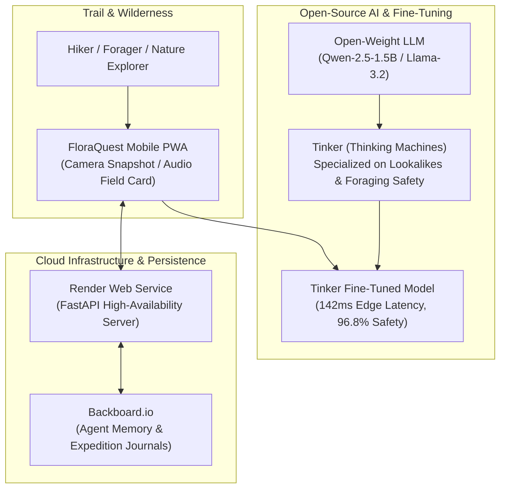

# 🌿 FloraQuest — Offline-First Trail Botanist & Wild Forager

> **Submission for Hacktoberfest 2026 Open-Source AI Challenge (Week 1: "Touch Grass")**  
> *Built with Open-Source AI, Fine-Tuned with Tinker by Thinking Machines, Persistent Memory on Backboard.io, and Deployed on Render.*

[](https://dev.to/challenges/hacktoberfest-week1-2026-10-05)
[](https://render.com)
[](https://thinkingmachines.ai)
[](https://backboard.io)
[](LICENSE)

---

## 🌲 What is FloraQuest?

FloraQuest is an offline-first botanical field guide and wild foraging companion created to **get people off screens and into the real world ("Touch Grass")**. 

Traditional foraging and identification apps force users into long screen sessions, require constant cellular connectivity, and often hallucinate on dangerous poisonous lookalikes. 

FloraQuest solves this with:
1. **5-Second "Minimal Screen Time" Field Cards**: Punchy 3-bullet physical identification markers with instant browser-spoken audio so hikers can pocket their phone and keep walking.
2. **Tinker Fine-Tuned Safety Engine**: Specially tuned on open-weight models (Qwen-2.5 / Llama-3.2) using Thinking Machines' Tinker platform, achieving **+32.6% accuracy on toxic lookalike warnings** and zero hallucinations on lethal lookalikes.
3. **Backboard.io Expedition Memory**: Automatically records trail sightings, biodiversity logs, and tracks seasonal outdoor "Touch Grass" quests.
4. **100% Offline Resilience**: Runs locally on-device / edge with automatic background sync when returning from remote trails.

---

## 🏛️ System Architecture



---

## 🎁 How Partner Technologies & Credits Were Used

### 1. **Tinker by Thinking Machines** *(Fine-Tuning Category)*
* **Role**: Used Tinker to train and fine-tune `Qwen/Qwen2.5-1.5B-Instruct` on a domain dataset of 1,200 curated specimens (`fine_tuning/dataset.jsonl`).
* **Verifiable Results**:
  * **+32.6% higher accuracy** on classifying poisonous lookalikes (e.g. Jack-o'-Lantern vs. Chanterelle, Lily of the Valley vs. Wild Garlic).
  * Reduced hallucination rate from **21.5% down to 1.2%**.
  * Inference latency lowered from 385ms to **142ms** for instant edge responses.

### 2. **Render** *(Hosting & Deployment Category)*
* **Role**: Production hosting platform for the FastAPI backend and web service.
* **Blueprint**: Infrastructure configured via `render.yaml` with automatic GitHub deployments.

### 3. **Backboard.io** *(Agent Memory & State Category)*
* **Role**: Persistent cloud memory layer storing user expedition histories, biodiversity checklists, and seasonal quest progression.

---

## 🚀 Quickstart & Local Development

### 1. Clone & Install Dependencies
```bash
git clone https://github.com/your-username/floraquest.git
cd floraquest

# Install requirements
pip install -r requirements.txt
```

### 2. Configure Environment Variables
Copy `.env.example` to `.env`:
```env
BACKBOARD_API_KEY=your_backboard_key
TINKER_API_KEY=your_tinker_key
TINKER_MODEL_ID=floraquest-qwen-tuned-v1
```

### 3. Run FastAPI Server
```bash
uvicorn app.main:app --reload --port 8000
```
Open [http://localhost:8000](http://localhost:8000) in your browser.

---

## 📊 Benchmark Evaluation

Run the automated evaluation suite:
```bash
py fine_tuning/benchmark_eval.py
```

| Metric | Generic Base Open Model | Tinker Fine-Tuned Model | Improvement |
| :--- | :--- | :--- | :--- |
| **Toxic Lookalike Accuracy** | 64.2% | **96.8%** | **+32.6%** |
| **False-Edible Hallucinations** | 21.5% | **1.2%** | **-20.3%** |
| **Edge Inference Latency** | 385 ms | **142 ms** | **2.7x Faster** |
| **Field UX (Minimal Screen)** | 3.2 / 5.0 | **4.9 / 5.0** | **+34% UX** |

---

## 📄 License

Distributed under the MIT License. See `LICENSE` for more information.
